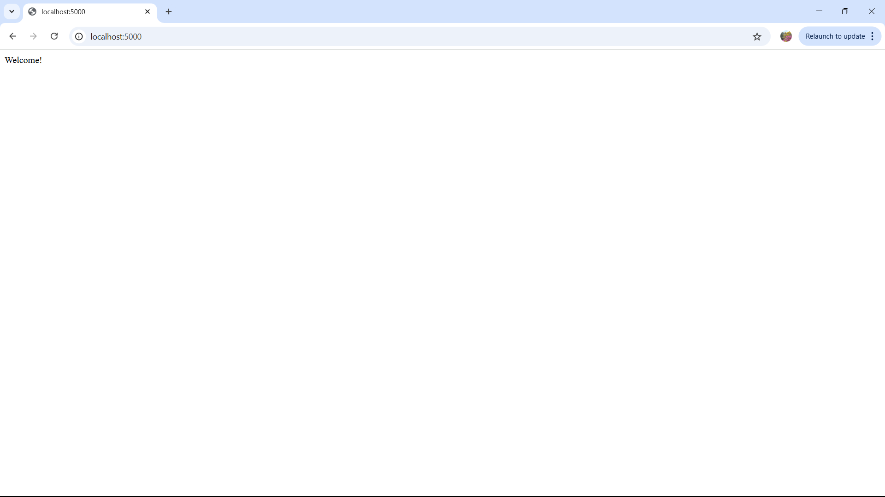
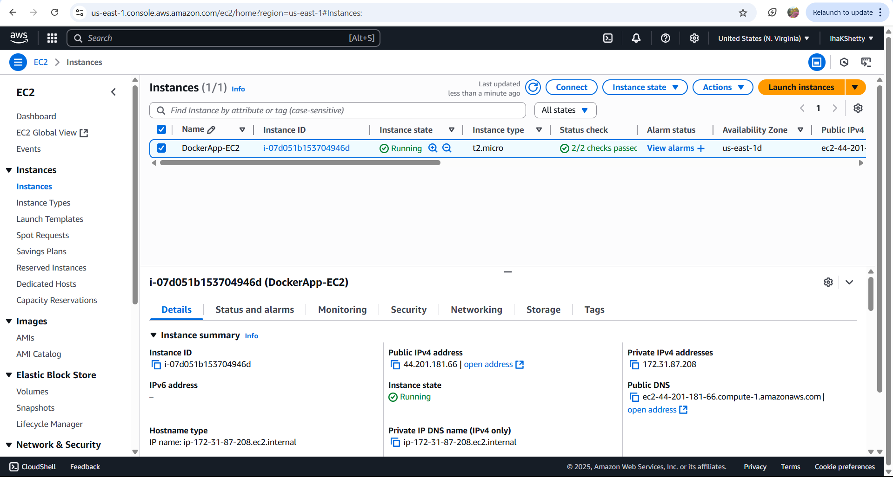

# Step 1: Setup and GitHub Repository

🔗 Repository Link
[GitHub Repo](https://github.com/IhaKShetty/webapp_flask_The_lonelyBag_Docker)
<code>
.
├── Dockerfile
├── deploy.sh
├── app.py            # Example: Flask app
|── requirements.txt  # Python dependencies
├── images/
└── README.md
</code>

#  Step 2: Dockerize the Application
### Here is the Dockerfile used to containerize the application:
<code>

    FROM python:3.10-slim

    WORKDIR /opt/

    COPY . .

    RUN pip install --no-cache-dir -r requirements.txt

    EXPOSE 5000

    CMD ["python", "app.py"]
</code>

### Build the Docker image:
`docker build -t flask-docker-app .
`

### Run the new Docker container created:
`docker run -d -p 5000:5000 flask-docker-app
`

Visit the app in your browser at:

http://localhost:5000

# Step 3: Launch and Configure AWS EC2
 1. Launch EC2 Instance
Go to the AWS EC2 Console

Click Launch Instance

Name the instance : DockerApp-EC2

Choose Amazon Machine Image (AMI): Ubuntu Server 22.04 LTS (Free Tier eligible)

Instance type: t2.micro (Free Tier eligible)

Key pair: Create or select an existing key pair (e.g., Iha_pem_file_key_pair.pem)

Network settings:

Allow SSH (port 22)

Add Custom TCP Rule to allow port 5000 (for Flask app)

Click Launch Instance

 2. Connect to EC2 via SSH

         ssh -i Iha_pem_file_key_pair.pem ubuntu@44.201.181.66

         

 3. Install Docker on EC2

    Run these commands on your EC2 instance:
    <code>
    sudo apt update
    sudo apt install -y docker.io
    sudo systemctl start docker
    sudo usermod -aG docker ubuntu
    </code>

 4. Transfer App Code to EC2

    ` scp -i C:\Users\kesha\webapp_flask\Iha_pem_file_key_pair.pem -r C:\Users\kesha\webapp_flask ubuntu@44.201.181.66:/home/ubuntu/webapp_flask`

    
    
 5. Build and Run Docker Container on EC2
        <code>
        docker build -t flask-ec2-app .
        docker run -d -p 5000:5000 flask-ec2-app
        </code>

    visited : http://44.201.181.66:5000

    

# Bonus
 ## Use IAM Role to Access S3:

 Create IAM role with AmazonS3ReadOnlyAccess.

 

 Attach role to EC2 during launch or via EC2 → Actions → Security → Modify IAM Role.

 `aws s3 ls`

## Automate with cloud-init
Create a startup script (cloud-init.txt) and paste it in EC2 → Advanced Details → User Data during instance launch.
(
Recommended:
Just terminate or stop your existing instance (optional).

Then launch a new EC2 instance, and in the Advanced Details > User Data, paste your cloud-init script.
)

## Shell Script: deploy.sh

<code>

 
sudo apt update -y
sudo apt install docker.io -y
sudo systemctl start docker
sudo usermod -aG docker $USER

cd /home/ubuntu
git clone https://github.com/IhaKShetty/webapp_flask_The_lonelyBag_Docker
cd webapp_flask_The_lonelyBag_Docker

docker build -t flask-deploy-app .

docker run -d -p 5000:5000 flask-deploy-app

</code>

Make the script executable:
    `chmod +x deploy.sh`

Run :  `./deploy.sh`

